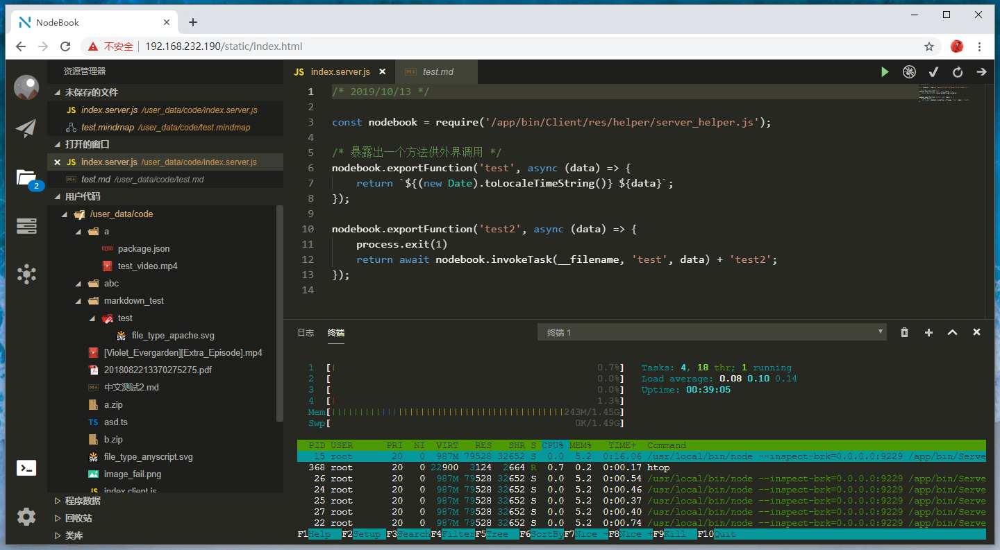

# nodebook

> sudo docker pull registry.cn-hangzhou.aliyuncs.com/wujingtao/nodebook:\[[发布版本号](https://github.com/mx601595686/nodebook/releases)\]

## 简介

类似于 VScode 的在线代码编辑器。当初开发这款编辑器的目的是为了能够方便的在服务器上进行代码编辑，类似于[jupyter](https://jupyter.org/)，用于数据挖掘方面的研究，不过现在 VScode 原生支持[远程开发](https://marketplace.visualstudio.com/items?itemName=ms-vscode-remote.vscode-remote-extensionpack)和[浏览器运行](https://github.com/cdr/code-server)了所以就将代码开源出来，不过到目前为止(2019 年)该编辑器还是有一些功能上的优势。

## 主要功能

-   支持命令行 terminal
-   支持 Node 远程调试
-   Node 进程管理，和进程崩溃邮件提醒
-   [Node 进程](./src/Client/res/helper/server_helper.d.ts)和[网页](./src/Client/res/helper/client_helper.d.ts)间消息通信
-   自动代码备份
-   支持[思维导图](https://github.com/fex-team/kityminder)

## 代码命名规范

-   所有服务器端代码全部以`*.server.js`命名
-   所有浏览器端代码全部以`*.client.js`命名
-   思维导图文件以`.mindmap`结尾

## 默认用户名、密码

-   username：`node@book.com`
-   password：`123456`

## Docker 环境变量

-   `DOMAIN` 网站的域名
-   `DEBUG` 是否开启调试模式
-   `TZ` 时区，默认是上海

## Docker 挂载点

-   `/user_data` 用户数据目录
-   `/program_data` 程序数据目录
-   `/key` 存放 HTTPS 证书的目录
    -   `./privkey.pem` openssl 私钥密码
    -   `./cert.pem` openssl 公钥路径
    -   `./password.pem` openssl 私钥密码（没有可以忽略）

## 加密备份文件编码

在使用解压软件打开加密备份文件时可能会出现乱码，将解压软件的字符编码选择为`UTF8`即可

## npm script 说明

-   npm run compileServer 编译服务器端代码
-   npm run compileClient 编译浏览器端代码
-   npm run compileClientWatch 以 Webpack Watch 模式编译浏览器端代码
-   npm run resetUser 重置数据库中的用户名与密码
-   npm run cleanIPFilter 清空数据库中的 IP 访问限制
-   npm run resumeFromBackup 从备份文件恢复用户数据。使用时需要传入备份文件的文件名(不是文件的绝对路径)

## 更新或添加浏览器端编辑器的代码提示依赖

[`src/Client/module/MainWindow/Area/ContentWindow/Windows/CodeEditorWindow/CodeEditorWindowContent.tsx`](./src/Client/module/MainWindow/Area/ContentWindow/Windows/CodeEditorWindow/CodeEditorWindowContent.tsx)

# 版本依赖提示

-   "video-react": "0.13.2" 就使用这个版本，新版本用 babel 打包，大小会增大许多
-   "monaco-editor": "0.16.0" 高于这个版本会与 "monaco-editor-webpack-plugin": "1.7.0" 出现兼容性问题
